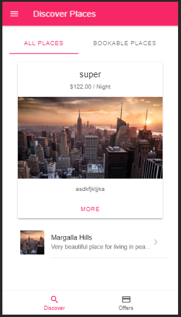
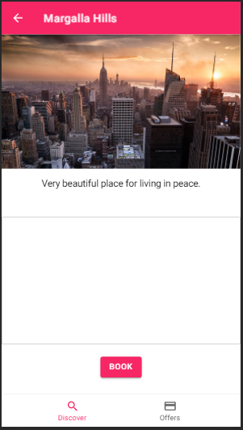
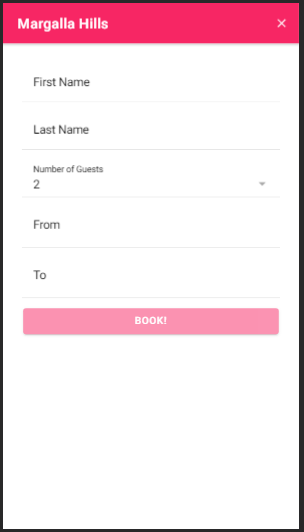
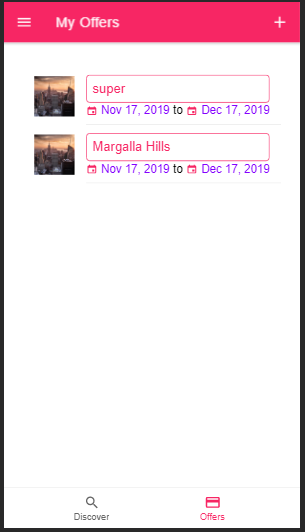
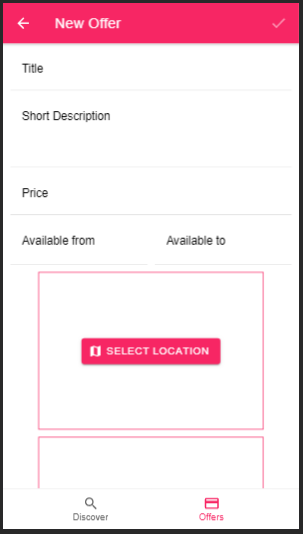
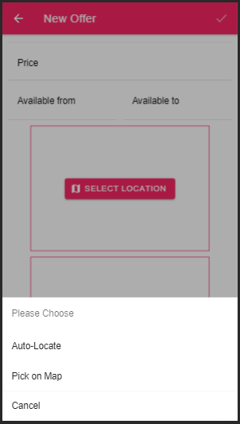
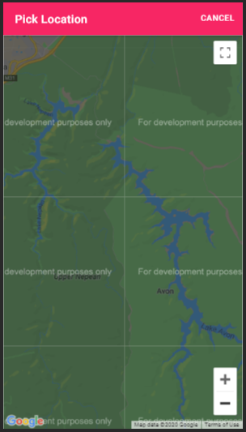

# Bookings.pk
<h3>Description<h3>

Ionic application which book places online(like airbnb), user can also offer their own places by adding name of location, short discription, adding some images, picking location on google Maps and it's Done!

<h1>This is the login page:-</h1>

<h1>This is Slide Menu:-</h1>

<h1>This is Home Menu:-</h1>

<h1>This is Bookings page:-</h1>

<h1>This is Booking Menu:-</h1>

<h1>This is Offers page:-</h1>

<h1>This is Offer Menu:-</h1>

<h1>This module is Picking Location:-</h1>

<h1>This is google Maps:-</h1>

<h3>How to Run<h3>
<li>Clone repository</li> 
<li>Run "npm install"</li>
<li>Run "ionic serve"</li>

